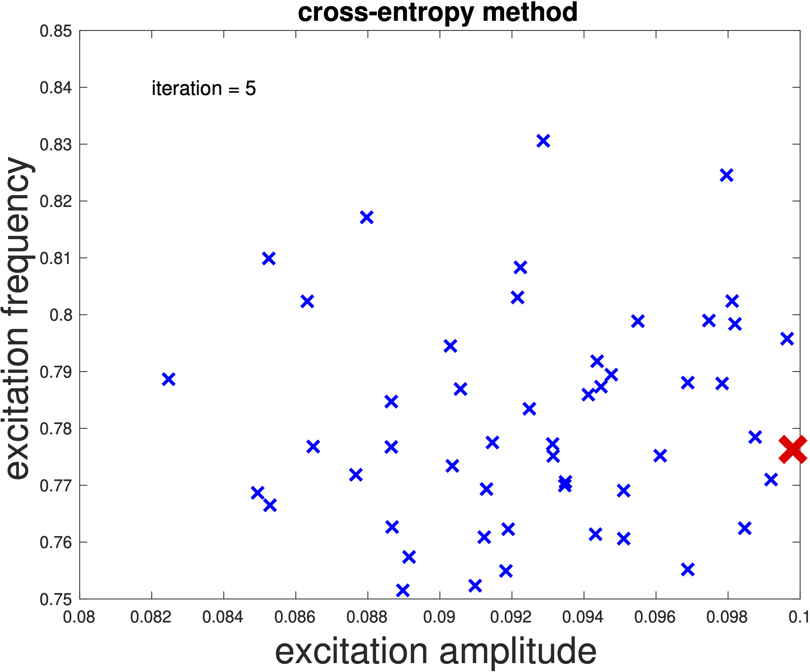

## Harvester Optimizer

**HarvesterOpt: Harvester Optimizer** is Matlab code designed to solve optimization problems aimed at maximizing the energy recovery of bistable piezo-magneto-elastic energy harvesting systems. This tool leverages the Cross-Entropy method to enhance the performance and efficiency of energy harvesters, making it a valuable asset for researchers and engineers in the field of energy harvesting.

<p align="center">

</p>

**HarvesterOpt** is the optimization module of the package **STONEHENGE - Suite for Nonlinear Analysis of Energy Harvesting Systems**, which can be downloaded <a href="https://americocunhajr.github.io/STONEHENGE" target="_blank">here</a>.

### Table of Contents
- [Overview](#overview)
- [Features](#features)
- [Usage](#usage)
- [Documentation](#documentation)
- [Videos](#videos)
- [Author](#author)
- [Citing HarvesterOpt](#citing-harvesteropt)
- [License](#license)
- [Institutional support](#institutional-support)
- [Funding](#funding)

### Overview
**HarvesterOpt** was developed to optimize the amount of energy recovered by a nonlinear bistable piezoelectric energy harvester. The underlying results are reported in the following publication:
- **A. Cunha Jr**, *Enhancing the performance of a bistable energy harvesting device via the cross-entropy method*, Nonlinear Dynamics, 103:137-155, 2021 <a href="https://doi.org/10.1007/s11071-020-06109-0" target="_blank">DOI</a>

Preprint available <a href="https://hal.archives-ouvertes.fr/hal-01531845v3" target="_blank">here</a>.

### Features
- Optimizes energy recovery in bistable piezo-magneto-elastic energy harvesting systems
- Utilizes advanced optimization algorithms for maximum efficiency
- Supports customization of optimization parameters and constraints
- Includes visualization tools for simulation results
- Offers well-documented, easy-to-understand code
- Designed with an educational approach for intuitive use

### Usage
To get started with **HarvesterOpt**, follow these steps:
1. Clone the repository:
   ```bash
   git clone https://github.com/americocunhajr/HarvesterOpt.git
   ```
2. Navigate to the code directory:
   ```bash
   cd HarvesterOpt/HarvesterOpt-1.0
   ```
3. For direct search optimization, execute:
   ```bash
   HarvesterOpt_DirectSearch
   ```
4. For cross-entropy optimization, execute:
   ```bash
   HarvesterOpt_CrossEntropy
   ```

This package includes the following files:
* CrossEntropyOpt_Example.m.  -- script with an one dimensional optimization with the CE method
* HarvesterOpt_DirectSearch.m -- script with a program to optimize the harveters via direct serach
* HarvesterOpt_CrossEntropy.m -- script with a program to optimize the harveters via CE method
* PiezoMagBeam_ObjFunc.m.     -- function that defines the objetive function
* PiezoMagBeam_ObjFuncNoise.m -- function that defines the objetive function with noise
* PiezoMagBeam_RHS.m          -- function that defines the harvester equations
* test01chaos.m               -- function to compute the 0-1 test for chaos
* trandn.m                    -- function to draw samples from truncated distribution
* plot_ce_animation.m         -- function to plot an animation with CE search for the optimum
* graph_contour_pnt.m         -- function to plot a contourmap and a given point
* graph_binarymap.m           -- function to plot a binary contourmap

### Documentation
The routines in **HarvesterOpt** are well-commented to explain their functionality. Each routine includes a description of its purpose, as well as inputs and outputs. 

### Videos
Animations illustrating the operation of the CE method can be seen on <a href="https://www.youtube.com/playlist?list=PLjNDdMKtfqVnU4QIubzpeE25szNEbEdBZ" target="_blank">YouTube</a>.

### Author
- Americo Cunha Jr

### Citing HarvesterOpt
If you use **HarvesterOpt** in your research, please cite the following publication:
- *A. Cunha Jr, Enhancing the performance of a bistable energy harvesting device via the cross-entropy method, Nonlinear Dynamics, 103:137-155, 2021 https://doi.org/10.1007/s11071-020-06109-0*

```
@article{CunhaJr2021p137,
   author  = {A. {Cunha~Jr}},
   title   = {Enhancing the performance of a bistable energy harvesting device via the cross-entropy method},
   journal = {Nonlinear Dynamics},
   year    = {2021},
   volume  = {103},
   pages   = {137-155},
   note    = {https://doi.org/10.1007/s11071-020-06109-0},
}
```

### License
**HarvesterOpt** is released under the MIT license. See the LICENSE file for details. All new contributions must be made under the MIT license.

 

### Institutional support


### Funding

 &nbsp; &nbsp;  &nbsp; &nbsp; 
