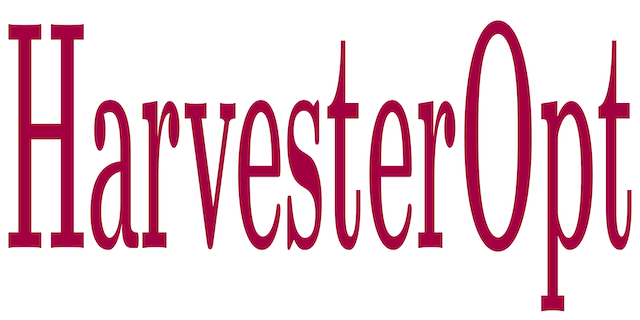

**HarvesterOpt - Harvester Optimizer** is an easy to run code to solve an optimization problem to maximize the energy recovered by a bistable piezo-magneto-elastic energy harvesting system. The implementation follows an educational style, to make its use very intuitive. 

This package includes the following files:
* CrossEntropyOpt_Example.m.  -- script with an one dimensional optimization with the CE method
* HarvesterOpt_DirectSearch.m -- script with a program to optimize the harveters via direct serach
* HarvesterOpt_CrossEntropy.m -- script with a program to optimize the harveters via CE method
* PiezoMagBeam_ObjFunc.m.     -- function that defines the objetive function
* PiezoMagBeam_ObjFuncNoise.m -- function that defines the objetive function with noise
* PiezoMagBeam_RHS.m          -- function that defines the harvester equations
* test01chaos.m               -- function to compute the 0-1 test for chaos
* trandn.m                    -- function to draw samples from truncated distribution
* plot_ce_animation.m         -- function to plot an animation with CE search for the optimum
* graph_contour_pnt.m         -- function to plot a contourmap and a given point
* graph_binarymap.m           -- function to plot a binary contourmap

## Software History

This code was developed to optimize the amount of energy recovered by a nonlinear bistable piezoelectric energy harvester. The simulation results associated with this optimization process are reported in the following paper:
- *Americo Cunha Jr, Enhancing the performance of a bistable energy harvesting device via the cross-entropy method, 2020*
https://hal.archives-ouvertes.fr/hal-01531845v3

## Videos
Animations illustrating the operation of the CE method can be seen in the following playlist:
- https://www.youtube.com/playlist?list=PLjNDdMKtfqVnU4QIubzpeE25szNEbEdBZ


## Author
- Americo Cunha

## Citing HarvesterOpt
We ask the code users to cite the following manuscript in any publications reporting work done with **HarvesterOpt**:
- *A. Cunha Jr, Enhancing the performance of a bistable energy harvesting device via the cross-entropy method, 2020*
https://hal.archives-ouvertes.fr/hal-01531845v3

```
@article{CunhaJr2020,
   author  = {A. {Cunha~Jr}},
   title   = {Enhancing the performance of a bistable energy harvesting device via the cross-entropy method},
   journal = {Preprint},
   year    = {2020},
   volume  = {~},
   pages   = {~},
   note    = {https://hal.archives-ouvertes.fr/hal-01531845v3},
}
```

## License
**HarvesterOpt** is released under the MIT license. See the LICENSE file for details. All new contributions must be made under the MIT license.

## Funding

 &nbsp; &nbsp;  &nbsp; &nbsp; 
